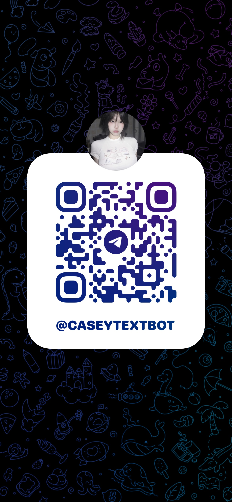

# Yuki-Telegram-AI-Companion

**“An AI-powered Telegram girlfriend that chats and talks with you.”**

## Introduction
**Yuki-Telegram-AI-Companion** is a playful AI chatbot built on Telegram.  
She acts like a flirty, caring girlfriend — replying in both text and voice.

This bot uses:
- 🤖 **OpenAI GPT** (custom endpoint) for conversations  
- 📝 **Google Speech Recognition** to understand voice messages  
- 🔊 **Fish Audio TTS** for natural voice replies  
- 📱 **Telegram Bot API** for seamless interaction  

> ⚠️ **Availability**  
> This bot **only works when the author runs the script locally**.  
> It is **not hosted on a server**, so availability depends on when the author starts the bot.

## Features
- 💬 Flirty, engaging conversations with Yuki (AI girlfriend persona)  
- 🎙️ Supports both text and voice input  
- 🔊 Voice replies generated with Fish Audio SDK  
- 📝 Converts voice messages to text with speech recognition  
- 📡 Interactive experience via Telegram  

## Chat with Yuki on Telegram
- Direct link: **[Yuki Telegram Bot](https://t.me/Caseytextbot)**  
- Or search in Telegram: **`Caseytextbot`**  

👉 You can chat with Yuki **only when the author is running the bot script**.

### 📱 Scan the QR Code
If you're on mobile, you can scan this QR code to open the bot directly:

## Disclaimer
This project is for personal use and fun. The bot persona is fictional.
